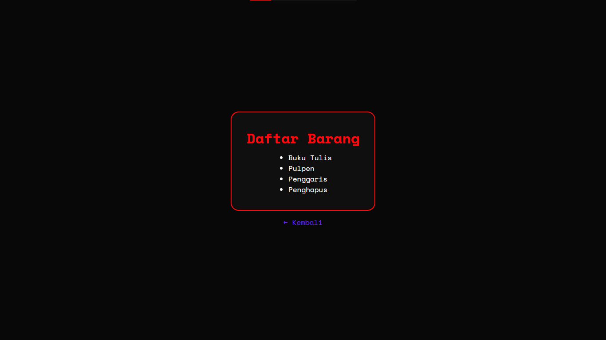
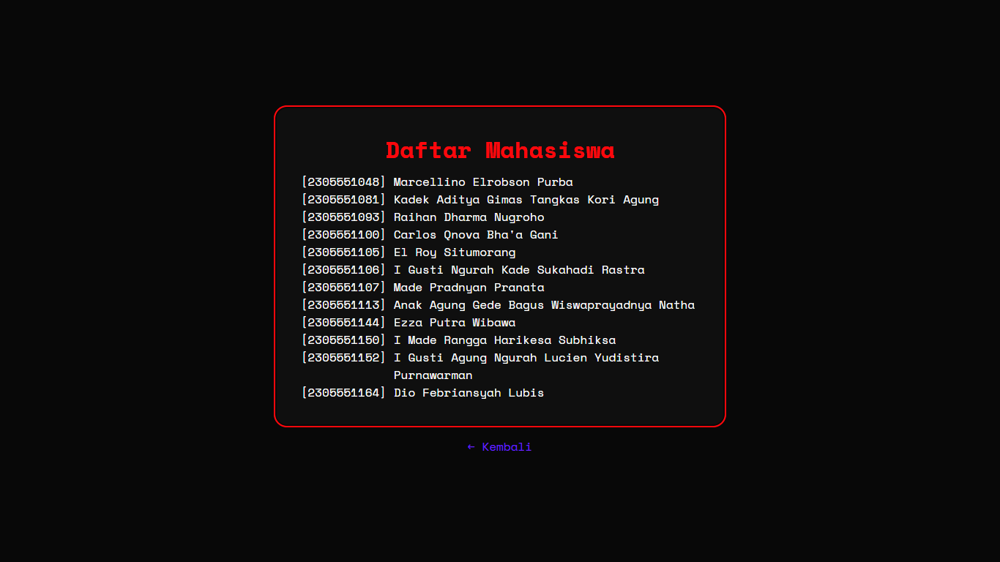
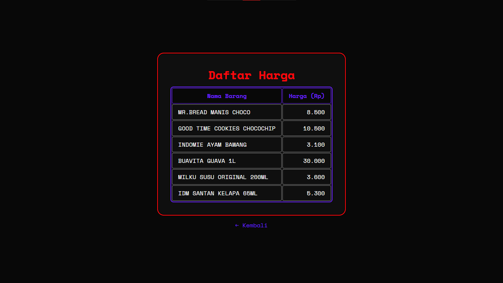
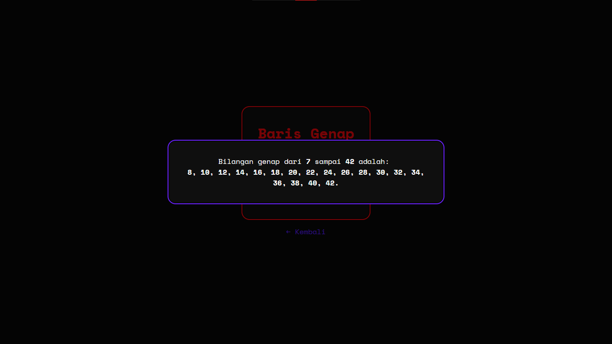
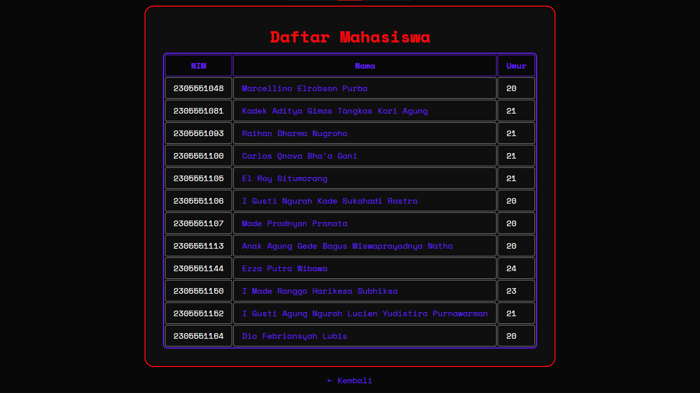
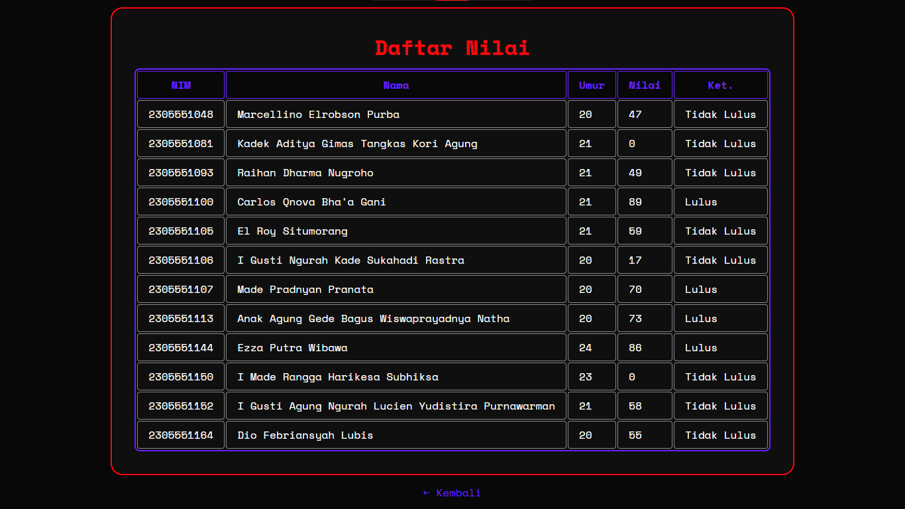

# Repo ProgNet 🌐
Repositori khusus materi dan penugasan pembelajaran kelas mata kuliah Pemrograman Internet.

<b>Disusun Oleh</b>
El Roy Situmorang (2305551105) [ <a href="https://github.com/el-ang"><b>GH</b></a> / <a href="https://www.instagram.com/el.ang_"><b>IG</b></a> / <a href="https://www.linkedin.com/in/el-ang"><b>LinkedIn</b></a> ]

**Kelas Mata Kuliah**: 24STIE05X021 - Pemrograman internet B

**Dosen Pengampu**: Ir. I Nyoman Piarsa, ST., MT., IPM.

## Daftar Isi
- [Daftar Isi](#daftar-isi)
- [PHP Dasar](#php-dasar)
   - 

<a href="#variabel-operator--kondisi">Variabel, Operator, & Kondisi</a>
<ul><li><a href="#form-ucapan">Form Ucapan</a></li><li><a href="#kalkulator-sederhana">Kalkulator Sederhana</a></li><li><a href="#ganjilgenap">Ganjil/Genap</a></li><li><a href="#nilai-huruf">Nilai Huruf</a></li><li><a href="#menu-makan">Menu Makan</a></li><li><a href="#form-biodata">Form Biodata</a></li></ul>

   - 

<a href="#loop--array">Loop & Array</a>
<ul><li><a href="#daftar-barang">Daftar Barang</a></li><li><a href="#daftar-mahasiswa">Daftar Mahasiswa</a></li><li><a href="#daftar-harga">Daftar Harga</a></li><li><a href="#baris-genap">Baris Genap</a></li><li><a href="#data-mahasiswa">Data Mahasiswa</a></li><li><a href="#nilai-mahasiswa">Nilai Mahasiswa</a></li></ul>

- [Web Dev](#web-dev)
- [Tribute](#tribute)
   - [License](LICENSE)

## PHP Dasar

### Variabel, Operator, & Kondisi

#### Form Ucapan

#### Kalkulator Sederhana

#### Ganjil/Genap

#### Nilai Huruf

#### Menu Makan

#### Form Biodata

### Loop & Array

#### Daftar Barang

#### Daftar Mahasiswa

#### Daftar Harga

#### Baris Genap

#### Data Mahasiswa

#### Nilai Mahasiswa

## Web Dev

## Tribute
[**© 2025 El Roy Situmorang**](LICENSE)

<b>PROGRAM STUDI SARJANA TEKNOLOGI INFORMASI FAKULTAS TEKNIK UNIVERSITAS UDAYANA GANJIL 2025/2026</b>