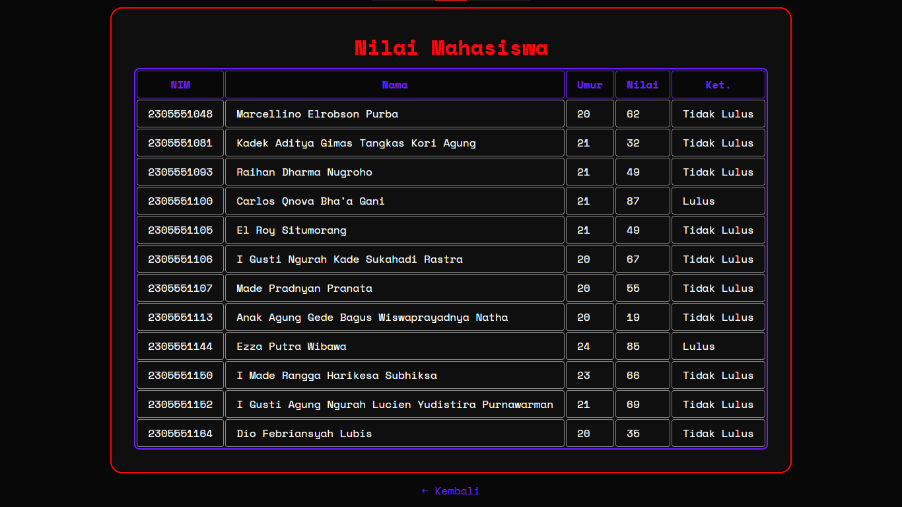

# Repo ProgNet 🌐
Repositori khusus materi dan penugasan pembelajaran kelas mata kuliah Pemrograman Internet.

<details><summary><b>Disusun Oleh</b></summary>El Roy Situmorang (2305551105)<br>

[](https://github.com/el-ang)&nbsp;[](https://linkedin.com/in/el-ang)&nbsp;[](https://instagram.com/el.ang_)</details>

**Kelas Mata Kuliah**:<br>24STIE05X021 - Pemrograman internet B

**Dosen Pengampu**:<br>Ir. I Nyoman Piarsa, ST., MT., IPM.

## Daftar Isi
- [PHP Dasar](#php-dasar)
   - <details><summary><a href="#variabel-operator--kondisi">Variabel, Operator, & Kondisi</a></summary>

      - [Form Ucapan](#form-ucapan)
      - [Kalkulator Sederhana](#kalkulator-sederhana)
      - [Ganjil/Genap](#ganjilgenap)
      - [Nilai Huruf](#nilai-huruf)
      - [Menu Makan](#menu-makan)
      - [Form Biodata](#form-biodata)
   </details>

   - <details><summary><a href="#loop--array">Loop & Array</a></summary>
   
      - [Daftar Barang](#daftar-barang)
      - [Daftar Mahasiswa](#daftar-mahasiswa)
      - [Daftar Harga](#daftar-harga)
      - [Baris Genap](#baris-genap)
      - [Data Mahasiswa](#data-mahasiswa)
      - [Nilai Mahasiswa](#nilai-mahasiswa)
   </details>

   - <details><summary><a href="#dasar-dasar-crud-mysql-dan-js-dom--event">Dasar-dasar CRUD MySQL dan JS DOM & Event</a></summary>
   
      - [Inisiasi DB & Tabel](#inisiasi-db--tabel)
      - [Koneksi DB](#koneksi-db)
      - [CRUD Mahasiswa](#crud-mahasiswa)
      - [Form Validasi](#form-validasi)
      - [Search & Sort](#search--sort)
      - [Implementasi Nilai](#implementasi-nilai)
   </details>
   
- [Web Dev](#web-dev)
- [Tribute](#tribute)
   - [License](LICENSE)

## Struktur Repo
```
ProgNet              # Repo Pemrograman Internet
├── assets              # Folder aset (stylesheet, gambar, font, dll)
│   ├── ...
│   └── img                # Folder gambar
│       ├── ...
│       └── snap              # Folder screenshot
├── licenses            # Folder lisensi
├── route               # Folder route (file PHP)
│   ├── 0                  # Folder tugas PHP Dasar · Variabel, Operator, & Kondisi
│   │   ├── calc.php          # Kalkulator Sederhana
│   │   ├── evenOdd.php       # Ganjil/Genap
│   │   ├── foodMenu.php      # Menu Makan
│   │   ├── formBio.php       # Form Biodata
│   │   ├── formGreet.php     # Form Ucapan
│   │   └── grade.php         # Nilai Huruf
│   ├── 1                  # Folder tugas PHP Dasar · Loop & Array
│   │   ├── even.php          # Baris Genap
│   │   ├── itemList.php      # Daftar Barang
│   │   ├── priceList.php     # Daftar Harga
│   │   ├── studentData.php   # Data Mahasiswa
│   │   ├── studentList.php   # Daftar Mahasiswa
│   │   └── studentScore.php  # Nilai Mahasiswa
│   └── 2                  # Folder tugas PHP Dasar · Dasar-dasar CRUD MySQL dan JS DOM & Event
│       ├── query.php         # Inisiasi DB & Tabel
│       ├── conn.php          # Koneksi Database
│       ├── crud              # Folder CRUD Mahasiswa
│       │   ├── index.php        # Tabel Data Mahasiswa
│       │   ├── add.php          # Form Validasi Tambah Data
│       │   ├── edit.php         # Form Validasi Edit Data
│       │   └── delete.php       # Konfirmasi Hapus Data
│       ├── sns.php           # Search & Sort
│       └── score.php         # Implementasi Nilai
├── index.php        # Halaman utama
└── README.MD        # Panduan & dokumentasi
```

## PHP Dasar

### Variabel, Operator, & Kondisi
- Memahami penggunaan variabel dan tipe data dalam PHP.
- Mampu menggunakan operator aritmatika, logika, dan perbandingan.
- Dapat menerapkan struktur kontrol sederhana (*if*, *if-else*, *switch*).
- Mampu membuat aplikasi sederhana berbasis *form input*. 

#### Form Ucapan
Menampilkan form untuk menginput nama, lalu menampilkan ucapan kepada nama yang dimasukkan.


#### Kalkulator Sederhana
Menampilkan form untuk menginput dua angka dan memilih operasi aritmatika, lalu menampilkan hasilnya.


#### Ganjil/Genap
Form untuk menginput angka, lalu menampilkan apakah angka tersebut ganjil atau genap.


#### Nilai Huruf
Form untuk menginput nilai angka, lalu menampilkan nilai huruf berdasarkan rentang nilai yang ditentukan.


#### Menu Makan
Form pilihan menu makanan dengan *switch-case*, lalu menampilkan harga berdasarkan pilihan.

> Gambar mengandung ilustrasi bersumber dari karya *Artificial Intelligence* (AI).

#### Form Biodata
Form untuk menginput biodata (nama, umur, jenis kelamin, dan alamat), lalu menampilkan data yang diinput.


### Loop & Array
- Memahami konsep perulangan (*looping*) di PHP seperti *for*, *while*, dan *foreach*.
- Memahami cara membuat dan mengakses *array (indexed & associative)*.
- Menggabungkan konsep *looping* dengan *array* untuk menampilkan data.

#### Daftar Barang
Menampilkan daftar barang di dalam *indexed array* dengan konsep *looping* melalui *list*.


#### Daftar Mahasiswa
Menampilkan daftar mahasiswa di dalam *associative array* dengan konsep *looping* menggunakan *foreach* melalui *list*.


#### Daftar Harga
Menampilkan daftar barang beserta harganya di dalam *associative array* dengan konsep *looping* melalui tabel.


#### Baris Genap
Menampilkan bilangan genap dari masukan angka awal hingga angka akhir menggunakan *for loop*.


#### Data Mahasiswa
Menampilkan data mahasiswa (nama, nim, umur, dan prodi) di dalam *multidimensional array* dengan *looping* melalui tabel.


#### Nilai Mahasiswa
Menampilkan data nilai mahasiswa (nama, nim, nilai, dan keterangan lulus/tidak lulus) di dalam *multidimensional array* dengan *looping* dan kondisi melalui tabel.


### Dasar-dasar CRUD MySQL dan JS DOM & Event

#### Inisiasi DB & Tabel

#### Koneksi DB

#### CRUD Mahasiswa

#### Form Validasi

#### Search & Sort

#### Implementasi Nilai

## Web Dev

## Tribute
[**© 2025 El Roy Situmorang**](licenses/LICENSE)

[Space Mono Font](https://github.com/googlefonts/spacemono) by [Colophon Foundry](https://instagram.com/colophonfoundry), distributed by [Google Fonts](https://fonts.google.com/specimen/Space+Mono)<br>[Boxicons](https://boxicons.com) by [Atisa](https://github.com/atisawd)<br>[Material Design Icons](https://github.com/google/material-design-icons) originated by [Google](https://google.com) and [Material Extension Icons](https://github.com/material-extensions/vscode-material-icon-theme) by [Philipp Kief](https://github.com/PKief)<br>[OverlayScrollbars](https://kingsora.github.io/OverlayScrollbars) by [Rene Haas](https://github.com/KingSora)

<sub><b>PROGRAM STUDI SARJANA<br>[TEKNOLOGI INFORMASI](https://instagram.com/hmtiudayana)<br>[FAKULTAS TEKNIK](https://instagram.com/ftunud)<br>[UNIVERSITAS UDAYANA](https://unud.ac.id)<br>GANJIL 2025/2026</b></sub>