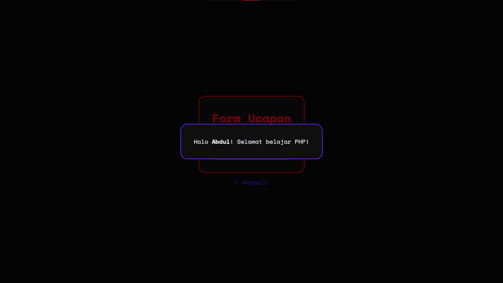

# Variabel, Operator, & Kondisi
- Memahami penggunaan variabel dan tipe data dalam PHP.
- Mampu menggunakan operator aritmatika, logika, dan perbandingan.
- Dapat menerapkan struktur kontrol sederhana (*if*, *if-else*, *switch*).
- Mampu membuat aplikasi sederhana berbasis *form input*. 

## Form Ucapan
Menampilkan form untuk menginput nama, lalu menampilkan ucapan kepada nama yang dimasukkan.

## Kalkulator Sederhana
Menampilkan form untuk menginput dua angka dan memilih operasi aritmatika, lalu menampilkan hasilnya.

## Ganjil/Genap
Form untuk menginput angka, lalu menampilkan apakah angka tersebut ganjil atau genap.

## Nilai Huruf
Form untuk menginput nilai angka, lalu menampilkan nilai huruf berdasarkan rentang nilai yang ditentukan.

## Menu Makan
Form pilihan menu makanan dengan *switch-case*, lalu menampilkan harga berdasarkan pilihan.

> Mengandung gambar ilustrasi bersumber dari hasil buatan *Artificial Intelligence* (AI).

## Form Biodata
Form untuk menginput biodata (nama, umur, jenis kelamin, dan alamat), lalu menampilkan data yang diinput.
