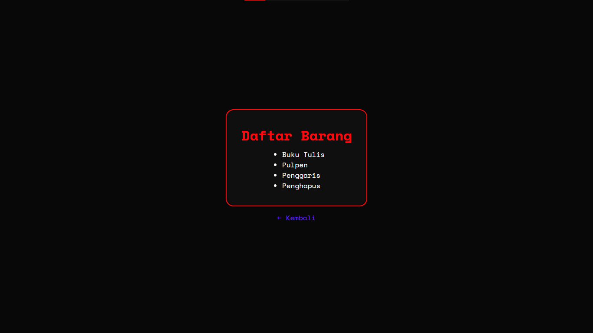
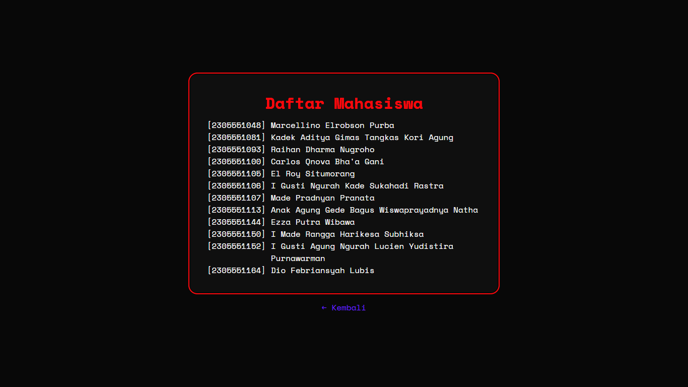
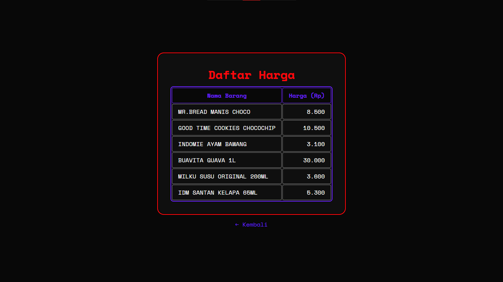
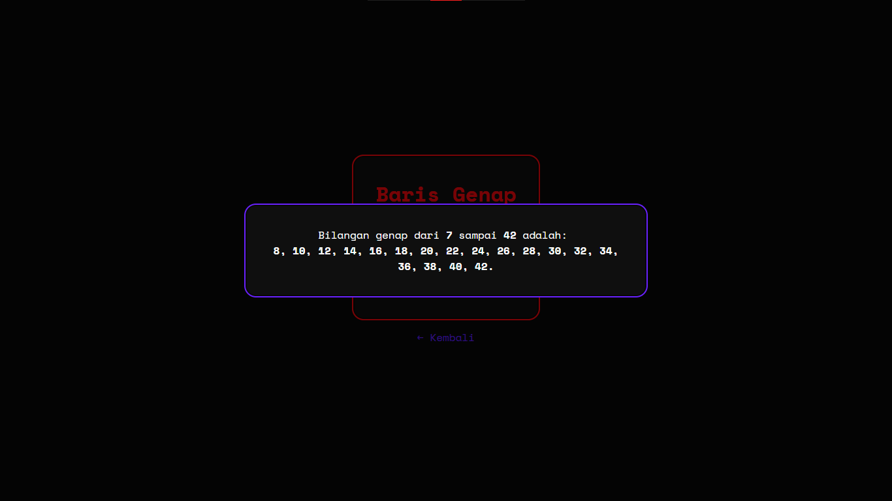
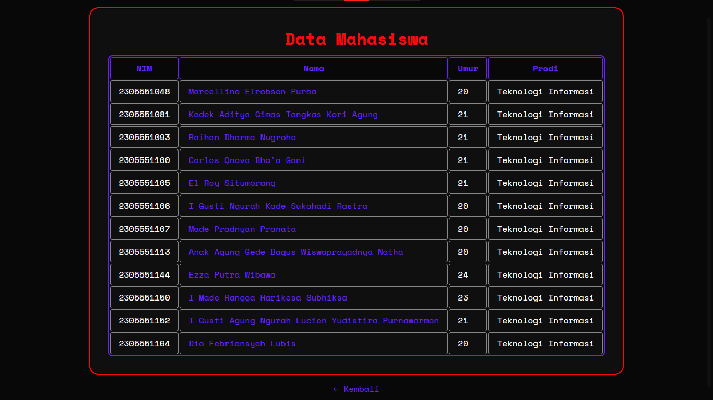
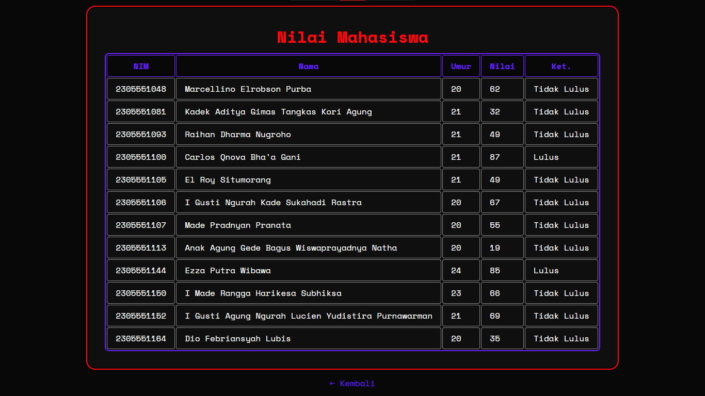

# Loop & Array
- Memahami konsep perulangan (*looping*) di PHP seperti *for*, *while*, dan *foreach*.
- Memahami cara membuat dan mengakses *array (indexed & associative)*.
- Menggabungkan konsep *looping* dengan *array* untuk menampilkan data.

## Daftar Barang
Menampilkan daftar barang di dalam *indexed array* dengan konsep *looping* melalui *list*.

## Daftar Mahasiswa
Menampilkan daftar mahasiswa di dalam *associative array* dengan konsep *looping* menggunakan *foreach* melalui *list*.

## Daftar Harga
Menampilkan daftar barang beserta harganya di dalam *associative array* dengan konsep *looping* melalui tabel.

## Baris Genap
Menampilkan bilangan genap dari masukan angka awal hingga angka akhir menggunakan *for loop*.

## Data Mahasiswa
Menampilkan data mahasiswa (nama, nim, umur, dan prodi) di dalam *multidimensional array* dengan *looping* melalui tabel.

## Nilai Mahasiswa
Menampilkan data nilai mahasiswa (nama, nim, nilai, dan keterangan lulus/tidak lulus) di dalam *multidimensional array* dengan *looping* dan kondisi melalui tabel.
